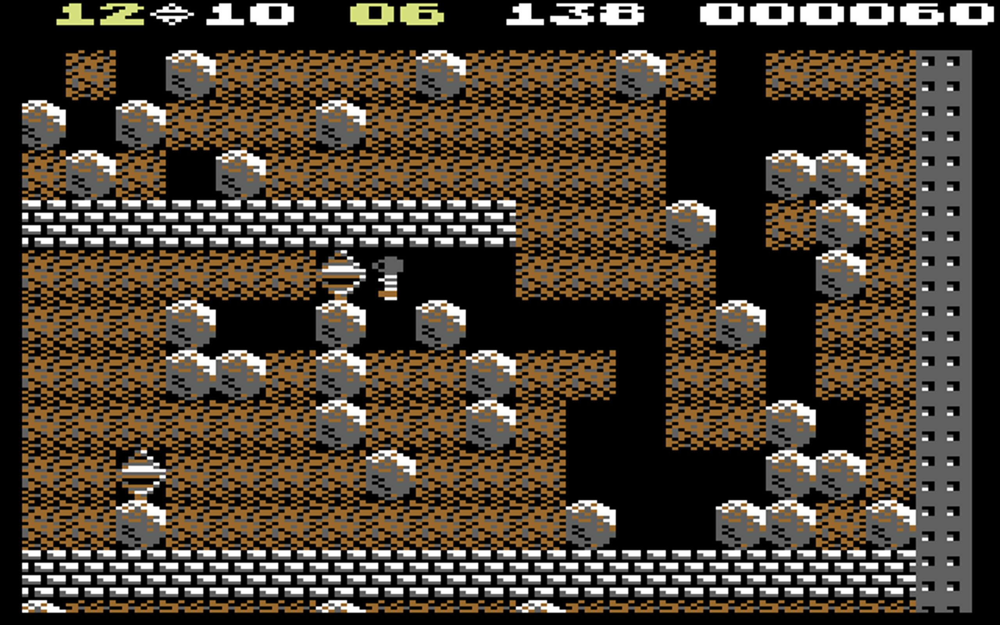

# Boulder Dash

**Boulder Dash takes place in a series of caves, each of which is laid out as rectangular grid of blocks. The player guides the player character, Rockford, with arrow keys. In each cave, Rockford has to collect as many diamonds as are needed and avoid dangers, such as falling rocks. When enough diamonds have been collected, the exit door opens, and going through this exit door completes the cave.**

<figure></figure>

### Inspiration

Your assignment is to create you version of this classical game. For inspiration, check out [this youtube video.](https://www.youtube.com/watch?v=FiEVfa1OK_o)

You can also try the orignal game [here.](https://boulder-dash.com/online-free-game/)

### Group Assignment - Scrum

This is a group assignment which means you need to work together in your team. The requirement here is that you work according to scrum. Now we have talked about scrum earlier in this course. Now I don't expect you to do it flawlessly but you will try, and see this as good practise for the future. When working with scrum you will need to make use of the five scrum events that you have learned.

- Sprint

  1. Sprint Planning
  2. Daily Scrum
  3. Sprint Review
  4. Spring Retrospective

The sprint will be two weeks long and the entire assignment period is four weeks. That means two sprints. So everything will come in two, exepct the dailies that will occur every weekday, at an agreed time together with the group.

I have included the PDF from earlier lessons that you can use as documentation from scrum.

### Requirements for Boulder Dash

The game must be create with Vite, React and TypeScript.

The basic requirements are the ones you can observe in the youtube video and the game at the top. But a small summary _( might be incomplete )_:

[Back to inspiration](#inspiration)

- The character should be movable.
- The background of the "tile" should change when you move through it. If any given tile starts as "dirt", the character excavates it automatically when it moves to that tile.
- Rocks that have excavated tiles underneath them, should fall down.
- Collect diamonds in order to win.
- If there are enemies, the character should loose when a enemy touches it.
- When the time runs out, you loose.
- Keep track of points and number of diamonds left to collect.
- At least two levels.

#### Extra

- More levels, if you complete one, go to the next.
- Enemy or enemies that move in the excavated tiles. How they move is up to you. Could be random or in a pattern, check the video at the top.

#### Limitations

- The level doesn't have to be bigger than the screen. It's okay to have a smaller static "grid". The background doesn't need to scroll.
- You don't need to have animations. Everything, _( like rocks )_ can move "step-by-step".
- It's enough if rocks fall straight down. It doesn't have to be a chain reaction, like rocks "rolls down" from eachother.

#### Grapich and inputs

You controll the character with the arrow keys or mouse clicking. The graphich should resemble the orignial but your creactivity here is limitless. Focus on the logic first, and the then the looks.
